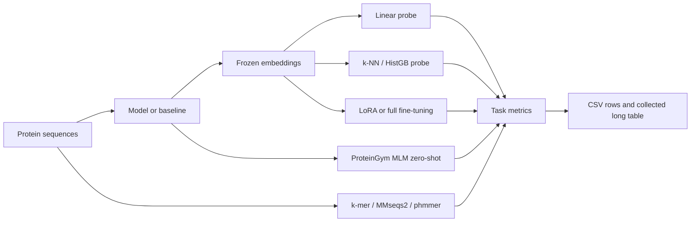

# ProtBench: a unified benchmark suite for protein representation evaluation

Authors: TODO

Affiliations: TODO

Contact: TODO

Repository: <https://github.com/ddofer/ProtBench>

## Abstract

**Motivation:** Protein language models and sequence-based protein predictors are
often evaluated with different train/test splits, task subsets, metrics, and
probe implementations. This makes it difficult to decide whether an observed
difference reflects the model or the evaluation harness.

**Results:** ProtBench is a lightweight benchmark suite for evaluating protein
representations under shared data handling, probe fitting, and metric reporting.
The current registry contains 43 public tasks spanning sequence-level
classification and regression, multilabel function prediction, retrieval,
residue-level labelling, and ProteinGym variant-effect prediction. ProtBench
supports frozen linear probes, k-nearest-neighbour probes, gradient-boosted tree
probes, optional full/last-layer/LoRA fine-tuning, masked-LM zero-shot scoring
for ProteinGym, and non-neural k-mer, MMseqs2, and phmmer baselines. Results are
written as per-task CSV rows and can be collected into a single long-format
table for model comparison. A representative public result slice shows how the
same test-split pipeline compares off-the-shelf ESM-2 scales and published
ProtSent models across heterogeneous tasks without changing evaluation code.

**Availability and implementation:** ProtBench is implemented in Python and uses
Hugging Face Transformers, datasets, PyTorch, scikit-learn, and optional PEFT,
MMseqs2, and pyhmmer integrations. Source code, task definitions, and dataset
provenance notes are available at <https://github.com/ddofer/ProtBench>.

## 1 Introduction

Protein language models such as ESM and ProtTrans models are now common starting
points for protein sequence analysis [@rives2021biological; @lin2023evolutionary;
@elnaggar2021prottrans]. New models are usually reported on a subset of
downstream tasks, but the evaluation details vary: papers differ in splits,
metric choices, pooling strategies, probe implementations, and whether sequence
alignment baselines are included. These differences are enough to obscure small
or task-specific gains.

ProtBench addresses this evaluation problem rather than proposing a new model.
It provides a single task registry and command-line harness for running many
protein model families through the same splits, embedding path, probes, and
metrics. The default use case is frozen-probe evaluation: a model is used once to
embed each protein, then a small supervised probe is trained on those embeddings.
This measures information that is accessible in the pretrained representation,
and it is cheap enough to run early during model development. More expensive
fine-tuning and zero-shot variant-effect modes are available when the scientific
question requires them.

## 2 System and Methods

ProtBench is organized around a `TaskConfig` registry in `benchmark_tasks.py`.
Each task records the dataset source, sequence and label columns, problem type,
split handling, and primary metric. The main benchmark runner loads a model,
embeds the relevant sequences, fits the selected probe, evaluates on a declared
split, and writes one CSV row per task, split, seed, and probe. The same registry
is reused by comparison, result-collection, fine-tuning, residue-probe, and
alignment-baseline scripts.



The linear probe is the default because it asks a narrow question: what task
signal is already linearly accessible from the representation? k-nearest
neighbour probes are useful for retrieval and annotation-transfer settings.
Gradient-boosted trees provide a non-linear probe for cases where the user wants
to test whether information is present but not linearly arranged. Sequence-level
fine-tuning supports frozen probes, full fine-tuning, last-layer updates, and
LoRA adapters [@hu2021lora]. Residue-level tasks use token embeddings and
per-residue metrics. ProteinGym zero-shot tasks use masked-marginal scoring for
substitutions and pseudo-log-likelihood differences for indels, with the clinical
sign convention chosen so higher scores correspond to the positive/pathogenic
class [@notin2023proteingym].

Three non-neural baselines are included. k-mer frequencies provide a composition
floor. MMseqs2 and phmmer provide alignment-based baselines using the same
prepared query and target splits as model probes [@steinegger2017mmseqs2;
@eddy2011accelerated; @larralde2023pyhmmer]. These baselines are important for
tasks where sequence similarity is already highly informative.

## 3 Benchmark Composition

The live registry currently contains 43 tasks: 35 standard probe tasks and 8
ProteinGym tasks. Table 1 summarizes the task types. The generated task
inventory in `paper/generated/task_inventory.tsv` records each task key,
display name, metric, preset, and dataset identifier.

**Table 1. ProtBench task coverage generated from the live registry.**

| Problem type | Tasks | Primary metric(s) |
| --- | ---: | --- |
| Binary classification | 12 | AUC |
| Multiclass classification | 5 | AUC, Accuracy |
| Multilabel classification | 3 | F1_Macro, F1_Micro |
| Regression | 17 | MSE, Spearman |
| Retrieval | 1 | Recall@10 |
| Residue-level token classification | 5 | F1_Macro, MCC, Spearman |

Dataset provenance is tracked separately from implementation details. Verified
entries include NetSurfP-2.0 secondary structure and missing-coordinate disorder,
SignalP 6.0 signal peptide labels, and a locally built DisProt 2024 residue-level
disorder task [@klausen2019netsurfp; @teufel2022signalp; @aspromonte2024disprot].
Other tasks are mapped to their likely upstream resources, including ProteinGym,
FLIP, CATH/EAT, SCOPe, DeepLoc, CAFA, TAPE/GFP fluorescence, Meltome Atlas,
PEER, ProFET, and PPI benchmark splits [@notin2023proteingym;
@dallago2021flip; @heinzinger2022contrastive; @fox2014scope;
@almagro2017deeploc; @zhou2019cafa; @rao2019tape; @sarkisyan2016local;
@jarzab2020meltome; @xu2022peer; @ofer2015profet; @bernett2024ppi]. Results
should cite these original sources rather than Hugging Face mirrors. Tasks whose
Hugging Face rehosts have not yet been traced to an original paper are retained
in the software but flagged in the supplement and dataset documentation.

## 4 Example Results

The purpose of the example table is to demonstrate the reporting surface, not to
claim a new state of the art. Table 2 uses one directly comparable public slice:
published ProtSent/ESM-2 35M runs from the ProtSent benchmark folder
[@protsent2026]. All rows are linear-probe test-split rows from the same result
suite, and each entry uses the task's declared primary metric. A separate
off-the-shelf ESM-2 35M/150M scale slice from the ProteinJEPA benchmark folder is
generated in the supplement [@proteinjepa2026].

**Table 2. Representative public ProtSent 35M linear-probe results. Higher is better.**

| Task | Metric | ESM-2 35M | ProtSent-V1 35M | ProtSent-V2 35M |
| --- | --- | ---: | ---: | ---: |
| Remote homology | Accuracy | 0.687 | 0.690 | 0.702 |
| Solubility | AUC | 0.696 | 0.693 | 0.698 |
| Signal peptide | AUC | 0.994 | 0.995 | 0.996 |
| Metal ion binding | AUC | 0.790 | 0.760 | 0.747 |
| Variant effect (GB1) | Spearman | 0.816 | 0.825 | 0.813 |
| Fluorescence | Spearman | 0.591 | 0.591 | 0.588 |
| Stability | Spearman | 0.440 | 0.511 | 0.388 |

The table illustrates why a shared harness is useful. Some tasks improve with
contrastive training, some are nearly saturated for all compared models, and
some move in the opposite direction. Because the rows share splits, probe type,
and metric selection, such differences can be inspected without mixing evaluation
code paths. Denser per-task tables and source file paths are generated in
`paper/generated/representative_results.md`.

## 5 Reproducibility and Use

ProtBench is designed to be run from a fresh clone with public data. Most tasks
download through `datasets.load_dataset`; local tasks such as DisProt,
conservation labels, and FLIP2 subtasks are built with scripts in `scripts/`.
The command below runs one model on a single task and writes a benchmark CSV:

```bash
python protein_benchmark_suite.py -m facebook/esm2_t6_8M_UR50D \
    --tasks solubility -p linear --eval_split test
```

For multi-model analysis, `collect_bench_results.py` normalizes probe CSVs and
fine-tuning JSONL outputs into `results/bench_results_all.csv`, one row per
model, task, probe, split, and metric. The paper assets can be refreshed with:

```bash
python3 scripts/paper_assets.py --out-dir paper/generated
```

## 6 Limitations

Frozen probes are a useful representation test, but they are not a substitute
for full downstream training when task-specific adaptation is the scientific
question. Some public datasets are third-party rehosts whose exact provenance,
filtering, or label semantics still require manual verification before they are
used in a formal result claim. ProteinGym zero-shot indel scoring can be slow and
uses caps for large assays. Finally, no benchmark suite removes the need to look
at task biology: composition, homology, and label imbalance can dominate some
benchmarks, which is why ProtBench includes k-mer and alignment baselines.

## 7 Conclusion

ProtBench provides a practical evaluation layer for protein representation work:
one task registry, shared probes and metrics, public dataset provenance notes,
alignment and composition baselines, and reusable result tables. Its main value
is not a new modelling claim, but a lower-friction way to make protein model
comparisons easier to reproduce and easier to audit.

## Acknowledgements

TODO.

## Funding

TODO.

## Conflict of Interest

TODO.

## References

See [references.bib](references.bib).
